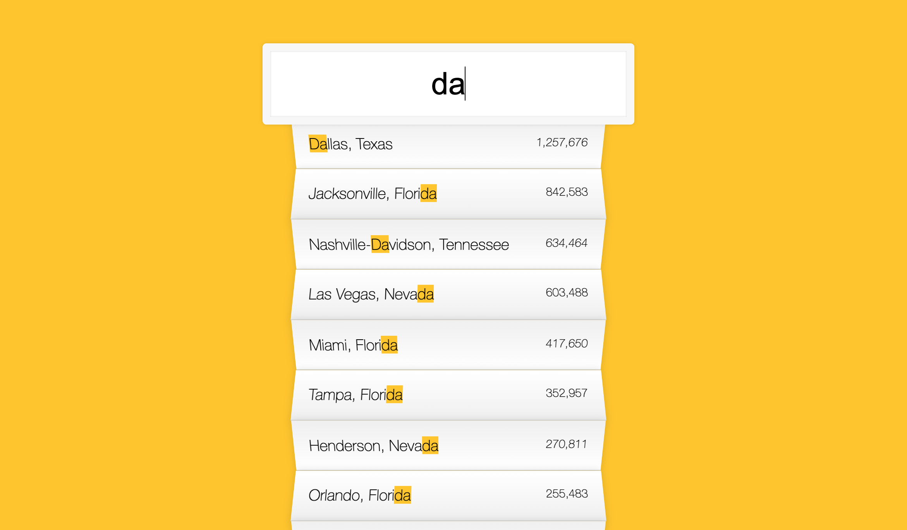

# Type Ahead

Day 6 of Javascript30 by WesBos. Made a search bar which shows all the suggestions in the suggestion bar. The searched term is also highlighted in yellow. Practied fetch, regex and basic JS principles

# Demo

# Technologies Used

HTML5, CSS, Vanilla JS

# Problems

Highlighting the searched term was tricky. Solved by injecting a span tag with the highlight class which replaced the city name.

# Website

https://buigabor.github.io/Type-Ahead/
